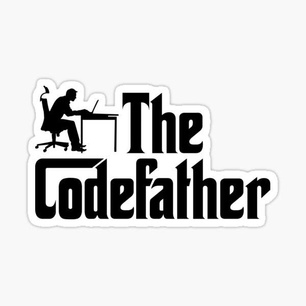

## Hi there 👋

I'm ***Android & Desktop Developer*** and little ***Server Side & WEB***

I have ***4 years*** experience ***OOP*** programming. I'm developing ***High-level*** application with ***Java***. My all applications have ***MVVM Design Pattern***

- 🚀 I'm currently improving self on ***mid and low-level programming***. Also ***IOS***

> Summary
>
> Java
> Kotlin
> C++
> Nodejs
> React
> Next
> Nginx
> Docker
> ***Not yet Swift & SwiftUI :))***
> ***Soon Pyhton :))***

<!--
**BatuhanAkar/BatuhanAkar** is a ✨ _special_ ✨ repository because its `README.md` (this file) appears on your GitHub profile.

Here are some ideas to get you started:

- 🔭 I’m currently working on ...
- 🌱 I’m currently learning ...
- 👯 I’m looking to collaborate on ...
- 🤔 I’m looking for help with ...
- 💬 Ask me about ...
- 📫 How to reach me: ...
- 😄 Pronouns: ...
- ⚡ Fun fact: ...
-->
